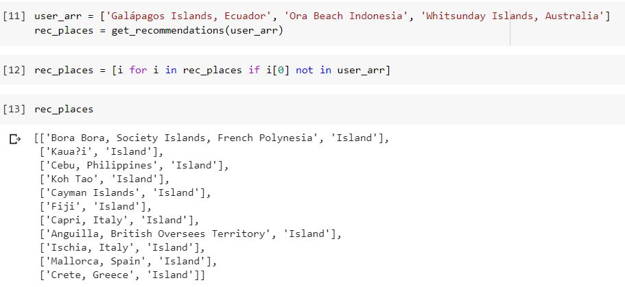

# Content-based Travel Place Recommendation System
It implements content-based filtering for providing Travel Places Recommendations.

The dataset used for this is custom which was created specifically for this project. It is populated with the information provided on various travel websites. Web Scraping was used to obtain the data. The dataset is also provided here. It contains mainly name of the place, type and description of the place.

TF-IDF vectors are calculated for each travel place and then Cosine Similarity matrix is generated which consists of similarity value from each travel place (content) TF-IDF vector to every other travel place TF-IDF vector.

The recommendations are generated based on individual user's preferences. Most similar travel places are recommended according to cosine similarity matrix.

Here are some of the results:

